# Real-Time Log Monitoring on AWS

An event-driven pipeline: an app writes JSON-lines logs to S3, each new file
triggers a Lambda that parses the records, runs anomaly detectors over them
(ERRORs, 5xx spikes, error-rate and latency-p99 thresholds), emails **one
consolidated alert** per file that trips a detector, and emits CloudWatch
metrics with an alarm on error spikes. A CloudWatch dashboard visualizes the
key metrics.

Built with AWS SAM (Python 3.12). Everything is free-tier friendly.

## Architecture



## How it works

1. **Ingest.** Any `.jsonl` object uploaded to the logs bucket fires an
   `s3:ObjectCreated:*` notification (suffix filter keeps CSVs, zips, etc.
   out of the pipeline).
2. **Parse.** The Lambda streams the object and parses it as JSON-lines.
   Malformed lines are *counted* in the `MalformedLines` metric — never fatal.
3. **Detect.** Four detectors run over every file's records:
   - `ERROR` records (`severity == "ERROR"`, case-insensitive) — the classic trigger;
   - **5xx spike**: ≥ `FIVEXX_THRESHOLD` responses with `status_code` 500–599;
   - **error rate**: `ERROR` records / total records ≥ `ERROR_RATE_THRESHOLD`;
   - **latency p99**: p99 of `latency_ms` / `duration_ms` ≥ `LATENCY_P99_THRESHOLD_MS`.
   Every detector that fires is named in the alert subject (`[5xx_spike]`)
   and detailed in the email body.
4. **Alert.** If a file contains errors or trips any detector, the function
   publishes **one** SNS message listing up to 5 error summaries, the
   detectors that fired, plus an overflow note (`+N more error(s)`), so a
   bad deploy can't spam the inbox. The email subject names the dominant
   service in the file (`[LogMonitor] 2 error(s) [payments] in 2026-09-13.jsonl`),
   followed by one `[detector]` tag per triggered detector, so the service
   on fire is visible at a glance in the inbox.
5. **Observe.** Per-file metrics carry `Service` (most common service in the
   file) and `LogFile` dimensions for dashboards; undimensioned
   `ErrorsSeen` / `ServerErrors5xx` / `ErrorRate` / `LatencyP99` datapoints
   are also emitted per file so the alarm and dashboard can aggregate across
   files and services. A CloudWatch dashboard (errors, 5xx, error rate,
   latency p99, Lambda invocations) is provisioned with the stack.
6. **Retry semantics.** A total S3 read failure or SNS publish failure raises,
   so Lambda's async retry reprocesses the object. Metric emission is
   best-effort so a CloudWatch hiccup never blocks an alert.

The IAM role is least-privilege: `s3:GetObject` on the logs bucket only,
`sns:Publish` on the alert topic only, `cloudwatch:PutMetricData` scoped to
the pipeline's namespace via condition, plus its own log group.

## Configuration

Detector thresholds are Lambda environment variables (set in
`template.yaml`, no code change needed to tune):

| Variable | Default | Meaning |
|---|---|---|
| `ERROR_SUMMARY_LIMIT` | `5` | Max error summaries listed in the alert email |
| `FIVEXX_THRESHOLD` | `5` | 5xx `status_code` responses per file that trip the 5xx-spike detector |
| `ERROR_RATE_THRESHOLD` | `0.10` | `ERROR` fraction of records that trips the error-rate detector |
| `LATENCY_P99_THRESHOLD_MS` | `2000` | p99 of `latency_ms`/`duration_ms` (ms) that trips the latency detector |
| `METRIC_NAMESPACE` | `LogMonitoring` | CloudWatch namespace |
| `EXPECTED_SUFFIX` | `.jsonl` | File suffix processed (matches the S3 trigger filter) |

The CloudWatch `error-spike` alarm threshold is a separate SAM parameter,
`ErrorThreshold` (default `5` errors in 5 minutes).

## Deploy

Prerequisites: AWS CLI configured, SAM CLI installed.

```bash
sam build
sam deploy --guided
```

`--guided` will ask for the stack name, region, and the `AlertEmail`
parameter. **Confirm the SNS subscription email** AWS sends you, otherwise
alerts stay in `PendingConfirmation`.

To see it work end to end:

```bash
BUCKET=$(aws cloudformation describe-stacks --stack-name <stack> \
  --query "Stacks[0].Outputs[?OutputKey=='LogsBucketName'].OutputValue" \
  --output text)

# A file with errors -> one alert email
cat > demo.jsonl <<'EOF'
{"ts":"2026-09-13T02:11:04Z","service":"payments","severity":"INFO","message":"charge ok"}
{"ts":"2026-09-13T02:11:05Z","service":"payments","severity":"ERROR","message":"card declined","request_id":"abc123"}
{"ts":"2026-09-13T02:11:06Z","service":"payments","severity":"ERROR","message":"upstream timeout"}
EOF
aws s3 cp demo.jsonl "s3://$BUCKET/demo.jsonl"

# A clean file -> no email, metrics still emitted
echo '{"ts":"2026-09-13T02:12:00Z","service":"payments","severity":"INFO","message":"all good"}' \
  | aws s3 cp - "s3://$BUCKET/clean.jsonl"
```

### Demo without real traffic

`scripts/generate_sample_logs.py` (stdlib only, no AWS credentials needed)
generates a realistic log file with a background error rate plus a
concentrated **error burst** partway through — 5xx statuses, ERROR
severities, spiking latency — so every detector fires on upload:

```bash
python3 scripts/generate_sample_logs.py --records 600 --burst-size 40
aws s3 cp demo-logs.jsonl "s3://$BUCKET/demo-logs.jsonl"
```

Expect one alert email whose subject carries `[5xx_spike] [error_rate]
[latency_p99]`, and watch the new metrics light up on the stack's
CloudWatch dashboard (`<stack-name>-log-monitor` in the console).

Useful flags: `--burst-at 0.6` (where in the file the burst lands),
`--error-rate 0.03` (background errors outside the burst), `--seed 42`
(reproducible output), `--output demo-logs.jsonl`.

## Testing matrix

| Case | How to reproduce | Expected result |
|---|---|---|
| Happy path | Upload `.jsonl` with ≥1 `ERROR` record | One SNS email listing errors; `ErrorsSeen`, `RecordsProcessed` metrics emitted |
| All-OK file | Upload `.jsonl` with no `ERROR`s | No email; metrics still emitted (`ErrorsSeen = 0`) |
| Malformed lines | Mix garbage lines / bad JSON into the file | File still processed; `MalformedLines` counts them; valid errors still alert |
| Large file | Upload a multi-MB `.jsonl` (within the 2 min timeout) | Processed line-by-line; alert lists first 5 errors + overflow note |
| Permission error | Revoke the role's `s3:GetObject` (or delete the object mid-flight) | Handler raises → Lambda async retry; error visible in CloudWatch Logs |
| Alarm firing | Upload files totaling ≥ `ErrorThreshold` errors in 5 min | `error-spike` alarm → `ALARM` → SNS email; returns to `OK` afterwards |
| Detectors | Upload `demo-logs.jsonl` from the generator script | One email with `[5xx_spike] [error_rate] [latency_p99]` in the subject; `ServerErrors5xx`, `ErrorRate`, `LatencyP99` metrics emitted |
| Dashboard | Deploy the stack, open CloudWatch → Dashboards | `<stack>-log-monitor` shows errors, 5xx, error rate, latency p99, invocations |
| Duplicate event | Same object notification delivered twice | Idempotent-ish: second run re-emits metrics and re-sends the email (documented; add a DynamoDB dedupe table if this matters to you) |

Run the unit suite (all AWS clients mocked, no credentials needed):

```bash
python3 -m pytest tests/ -q
```

## Cost (free tier)

| Service | Free tier | This project |
|---|---|---|
| Lambda | 1M requests + 400k GB-s / mo | A few invocations per log file |
| S3 | 5 GB storage, 20k GETs, 2k PUTs / mo | One bucket, tiny log files |
| SNS | 1,000 email publishes / mo | One email per error-containing file |
| CloudWatch | 10 metrics, 10 alarms, 5 GB logs | 6 metric names, 1 alarm, 1 dashboard, small log volume |

Realistic monthly cost at hobby scale: **$0**.

## Enhancement ideas

- Fan out alerts to Slack via AWS Chatbot in addition to email.
- Add a DynamoDB dedupe table (object ETag) to make duplicate deliveries a no-op.
- Compress/archive processed files to a second bucket with a lifecycle rule.
- Split `LogProcessor` into parse + alert steps with SQS for backpressure on huge files.
- Add per-service alarms (e.g. `payments` errors) using metric math.

